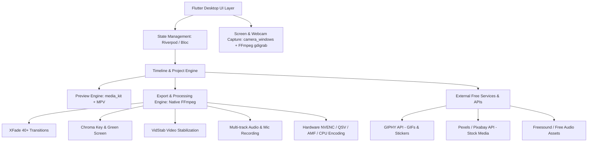

# Master Blueprint & AI Prompt: Building a 100% Feature-Complete Animotica Video Editor Clone in Flutter

> **Project Name:** OpenAnimotica / Flutter Movie Maker  
> **Target Platforms:** Windows 10/11 Desktop (Primary), macOS & Linux (Secondary)  
> **Tech Stack:** Flutter Desktop, Dart, `media_kit` (MPV engine), native FFmpeg engine, GitHub Actions CI/CD  
> **License:** Open Source (MIT / GPL-3.0 for FFmpeg compliance)

---

## 1. System Overview & Objective

The goal is to build an open-source, modern, hardware-accelerated video editing suite that clones **100% of Animotica's features, layout, workflow, and user interface** based on the provided screenshots and Microsoft Store feature analysis.

### Primary UI Structure & Flow (From Screenshots)
1. **Home / Dashboard (`Screenshot 1`):**
   - Left Sidebar: Brand logo, Navigation drawer button, Social/Community links, App version tag.
   - Hero Header: "Easy-to-use Video Editor & Movie Maker".
   - Primary Action Cards: `+ New project` (Vibrant Orange), `📁 Open a project`.
   - Core Workflow Tiles: `Edit video`, `Slideshow`, `Rotate video`, `Prepare videos for Animotica`.
   - **Quick Tools Grid (Instant 1-Click Utilities):**
     - ✂️ `Trim video`
     - 🔴 `Screen recording` (with desktop capture)
     - 🔤 `Add text, stickers or logo`
     - 🔁 `Reverse video`
     - 🎵 `Add background music`
     - 🎨 `Effects & Adjust` (Filters, LUTs, Brightness/Contrast/Saturation)
     - 🎧 `Extract MP3`
     - ⚡ `Fast or slow video` (Speed control & slow motion)
     - 🔇 `Mute video`
     - 🛡️ `Video stabilization` (Deshake using vid.stab)

2. **Project Canvas & Empty State (`Screenshot 2` & `Screenshot 3`):**
   - Top Bar: `← Project_Title - OpenAnimotica`, Window control buttons (Minimize, Maximize, Close), Feedback button.
   - Left Mini Toolbar: Menu drawer, Project Save icon.
   - Viewport Area: 16:9 / 9:16 / 1:1 / 4:5 preview canvas with aspect-ratio bounding box.
   - Drag & Drop Zone: Dotted target with icon and `+ Add video/photo clips` button.
   - **Add Media Dropdown / Popover Menu:**
     - 🟢 `Video or photo clips` (Local file picker)
     - 🎨 `Color clip & Background color` (Solid colors & gradient generator)
     - ⬛ `GIPHY` (Integrated online GIF and animated sticker search)
     - 📷 `Take a photo/video` (Direct webcam capture & snapshot)

3. **Clip Inspector & Single Timeline Mode (`Screenshot 4`):**
   - Main Player Viewport with real-time video rendering.
   - Transport & Scrubbing Bar:
     - ⚙️ Project Canvas Settings (Aspect ratio, background blur, resolution)
     - Timecode indicator (`0:00:0.00 / 0:00:4.00`)
     - Transport Controls: Jump to Start (`|◄`), Step Frame Back (`◄`), Play/Pause (`▶ / ⏸`), Step Frame Forward (`►`), Jump to End (`►|`), Volume slider (`🔊`).
     - Utility Controls: Undo (`↩`), Redo (`↪`), Canvas Grid/Background, Duplicate, Overlay Layers, Fullscreen (`⛶`).
   - Track Timeline: Interactive scrub bar with orange playhead and current frame bubble preview.
   - Bottom Action Bar: `← Go back`, `✂ Split`, `⏱ Duration`, `🎨 Color/Adjust`, `📄 Duplicate`, `🗑 Delete`.

4. **Multi-Clip Storyboard & Sequence Mode (`Screenshot 5`):**
   - Visual clip blocks representing each segment in chronological order with duration labels (e.g. `⏱ 00:04`).
   - Active clip highlighted with orange stroke and quick-action delete badge.
   - **Transition Nodes (`+` buttons):** Placed between each adjacent clip pair.
   - Total sequence duration tag (`Duration: 0:00:8.00`).
   - Watermark overlay preview toggle (optional customizable branding).

5. **Transition Gallery & Drawer (`Screenshot 6`):**
   - Real-time transition selector horizontal shelf below canvas:
     - `None`
     - `Opacity | Cross Fade`
     - `Fade Black`
     - `Fade White`
     - `Blur`
     - `Luma Fade A & B`
     - `Glow 100`
     - `Lens Flare 100`
     - `Wipe Left/Right/Up/Down`
     - `Slide & Zoom Transitions`
   - Real-time animated thumbnail preview for each transition preset.

---

## 2. Technical Architecture & Component Stack



### 2.1 Dependencies (`pubspec.yaml`)
```yaml
name: open_animotica
description: A high-performance, modern video editor and movie maker built with Flutter.
version: 1.0.0+1
environment:
  sdk: '>=3.2.0 <4.0.0'
  flutter: ">=3.16.0"

dependencies:
  flutter:
    sdk: flutter
  
  # State Management
  flutter_riverpod: ^2.5.1
  
  # Video Playback (Hardware-accelerated MPV engine)
  media_kit: ^1.1.10
  media_kit_video: ^1.2.4
  media_kit_libs_windows_video: ^1.0.8
  
  # File Operations & Desktop Integration
  file_picker: ^8.0.0
  path_provider: ^2.1.2
  path: ^1.9.0
  window_manager: ^0.3.8
  screen_retriever: ^0.1.9
  
  # Camera & Voice Recording
  camera: ^0.10.5+9
  camera_windows: ^0.2.1+8
  record: ^5.1.2
  audioplayers: ^6.0.0
  
  # Free Online APIs
  http: ^1.2.1
  cached_network_image: ^3.3.1
  
  # UI, Icons, Typography & Color
  fluent_ui: ^4.9.0 # Optional for Windows 11 styling
  google_fonts: ^6.2.1
  flutter_colorpicker: ^1.1.0
  uuid: ^4.4.0
  intl: ^0.19.0

dev_dependencies:
  flutter_test:
    sdk: flutter
  flutter_lints: ^3.0.0
```

---

## 3. Core Engine Implementation Details

### 3.1 FFmpeg Pipeline & Command Generator
The app manages a portable, bundled FFmpeg binary for Windows. All editing operations are mapped to deterministic, non-destructive FFmpeg commands.

#### A. Video Stabilization (Vid.stab)
```bash
# Pass 1: Motion vector detection
ffmpeg -y -i input.mp4 -vf vidstabdetect=stepsize=6:shakiness=8:accuracy=15:result=transforms.trf -f null -

# Pass 2: Stabilization transform
ffmpeg -y -i input.mp4 -vf vidstabtransform=input=transforms.trf:zoom=2:smoothing=12:interpol=bicubic -c:v libx264 -preset fast -crf 18 -c:a copy output_stabilized.mp4
```

#### B. Dynamic Transitions via `xfade`
```bash
# Complex filter combining Clip 1 and Clip 2 with Luma/Wipe/Fade
ffmpeg -y -i clip1.mp4 -i clip2.mp4 -filter_complex \
"[0:v][1:v]xfade=transition=fadeblack:duration=1:offset=3.0[v]; \
 [0:a][1:a]acrossfade=d=1[a]" \
-map "[v]" -map "[a]" -c:v libx264 -crf 19 output_merged.mp4
```

#### C. Chroma Key (Green Screen Removal)
```bash
ffmpeg -y -i background.mp4 -i greenscreen.mp4 -filter_complex \
"[1:v]colorkey=0x00FF00:0.3:0.1[ckout]; \
 [0:v][ckout]overlay=0:0[v]" \
-map "[v]" -map 0:a -c:v libx264 output_chroma.mp4
```

#### D. Screen Recording via FFmpeg (Direct Windows GDI)
```bash
# Capture full desktop 60 FPS + Stereo System Audio
ffmpeg -y -f gdigrab -framerate 60 -i desktop -c:v libx264 -preset ultrafast -pix_fmt yuv420p screen_recording.mp4
```

#### E. Color Clip & Gradient Generator
Generate solid or animated gradient clips purely in code or via FFmpeg `lavfi`:
```bash
ffmpeg -y -f lavfi -i "color=c=0x8A2387:s=1920x1080:d=4" -c:v libx264 -pix_fmt yuv420p color_clip.mp4
```

---

## 4. Free APIs & Cloud Asset Integration

1. **GIPHY API Integration (`GiphyService`):**
   - Search Endpoint: `https://api.giphy.com/v1/gifs/search?api_key=FREE_KEY&q={query}&limit=25`
   - Stickers Endpoint: `https://api.giphy.com/v1/stickers/search?api_key=FREE_KEY&q={query}`
   - Automatic download and transparency preservation as WebP/PNG overlays on video canvas.
2. **Pexels & Pixabay Free Stock API:**
   - Free royalty-free 4K/HD video and photo search directly within the media picker.
3. **Built-in Royalty Free Audio Library:**
   - Bundled sound effects (Pings, Whooshes, Pops, Applause) and ambient background music loops stored in `assets/audio/`.

---

## 5. Complete JSON Project Schema (`.openanimotica`)

```json
{
  "projectId": "animotica-proj-9488a032",
  "projectName": "Untitled_Project",
  "version": "1.0.0",
  "canvas": {
    "aspectRatio": "16:9",
    "width": 1920,
    "height": 1080,
    "fps": 60,
    "backgroundColor": "#000000"
  },
  "tracks": [
    {
      "id": "video-track-1",
      "type": "video",
      "clips": [
        {
          "id": "clip-001",
          "type": "gradient",
          "gradient": {
            "colors": ["#8A2387", "#E94057", "#F27121"],
            "angle": 45
          },
          "startTime": 0.0,
          "duration": 4.0,
          "speed": 1.0,
          "volume": 1.0,
          "transitionAfter": {
            "type": "fadeBlack",
            "duration": 1.0
          }
        },
        {
          "id": "clip-002",
          "type": "file",
          "filePath": "C:/Videos/sample.mp4",
          "startTime": 4.0,
          "sourceTrimStart": 2.0,
          "sourceTrimEnd": 6.0,
          "duration": 4.0,
          "speed": 1.0,
          "volume": 0.8
        }
      ]
    },
    {
      "id": "overlay-track",
      "type": "overlay",
      "elements": [
        {
          "id": "text-001",
          "type": "text",
          "text": "My Awesome Title",
          "fontFamily": "Montserrat",
          "fontSize": 48,
          "color": "#FFFFFF",
          "posX": 0.5,
          "posY": 0.2,
          "startTime": 1.0,
          "duration": 3.0
        }
      ]
    }
  ]
}
```

---

## 6. GitHub Actions CI/CD Pipeline (`.github/workflows/build_windows.yml`)

The project contains a complete, automated GitHub Actions workflow that:
1. Clones the repository on a `windows-latest` runner.
2. Sets up Flutter and all desktop tools.
3. Downloads the latest official static FFmpeg builds (GPL full shared/static) and places them into the app assets directory.
4. Compiles the Flutter Windows release build (`flutter build windows --release`).
5. Generates a standalone installer using Inno Setup (`OpenAnimotica-Setup.exe`) and a standalone `.zip`.
6. Automatically attaches the release binaries to GitHub Releases on version tag push.

```yaml
name: Build & Release Windows App

on:
  push:
    tags:
      - 'v*'
  workflow_dispatch:

jobs:
  build-windows:
    runs-on: windows-latest

    steps:
      - name: Checkout Code
        uses: actions/checkout@v4

      - name: Setup Flutter
        uses: subosito/flutter-action@v2
        with:
          flutter-version: '3.19.x'
          channel: 'stable'
          cache: true

      - name: Install Inno Setup
        run: choco install innosetup -y

      - name: Download & Bundle FFmpeg Static Binaries
        shell: powershell
        run: |
          New-Item -ItemType Directory -Force -Path "assets/bin"
          Invoke-WebRequest -Uri "https://github.com/BtbN/FFmpeg-Builds/releases/download/latest/ffmpeg-master-latest-win64-gpl.zip" -OutFile "ffmpeg.zip"
          Expand-Archive -Path "ffmpeg.zip" -DestinationPath "ffmpeg_extracted"
          Copy-Item -Path "ffmpeg_extracted/ffmpeg-master-latest-win64-gpl/bin/ffmpeg.exe" -Destination "assets/bin/ffmpeg.exe"
          Copy-Item -Path "ffmpeg_extracted/ffmpeg-master-latest-win64-gpl/bin/ffprobe.exe" -Destination "assets/bin/ffprobe.exe"

      - name: Install Dependencies
        run: flutter pub get

      - name: Build Windows Desktop Release
        run: flutter build windows --release

      - name: Copy FFmpeg to Output Directory
        shell: powershell
        run: |
          Copy-Item -Path "assets/bin/*" -Destination "build/windows/x64/runner/Release/"

      - name: Package Standalone Zip
        shell: powershell
        run: |
          Compress-Archive -Path "build/windows/x64/runner/Release/*" -DestinationPath "OpenAnimotica-Windows-Portable.zip"

      - name: Create GitHub Release
        uses: softprops/action-gh-release@v1
        if: startsWith(github.ref, 'refs/tags/')
        with:
          files: |
            OpenAnimotica-Windows-Portable.zip
        env:
          GITHUB_TOKEN: ${{ secrets.GITHUB_TOKEN }}
```

---

## 7. Master System Prompt for Complete App Generation

When invoking an AI coding agent to generate the complete codebase, provide this exact prompt:

```text
You are an expert Flutter Desktop & Video Processing Architect.
Your task is to build a complete, 100% working clone of the Animotica Video Editor for Windows in Flutter.

Requirements:
1. Recreate the exact UI/UX from the provided Animotica screenshots:
   - Dashboard with New Project, Open Project, 4 main action cards, and 10 Quick Tools (Trim, Screen Recording, Add Text/Stickers, Reverse, Background Music, Effects & Adjust, Extract MP3, Fast/Slow, Mute, Video Stabilization).
   - Project workspace with real-time video player preview (media_kit), timeline scrubber, frame step controls, aspect ratio selector (16:9, 9:16, 1:1, 4:5, 21:9), undo/redo.
   - Storyboard clip tray with multi-clip sequences, duration tags, delete badges, and '+' transition nodes between clips.
   - Transition selection drawer with 15+ animated xfade presets (Cross Fade, Fade Black, Fade White, Blur, Luma Fades, Wipe, Slide, Zoom).
   - Color clip generator (solid colors and multi-color gradients) and GIPHY API search modal for animated stickers/GIFs.
   - Webcam capture and mic voiceover recording.

2. Audio/Video Engine:
   - Use 'media_kit' for fluid hardware-accelerated timeline scrubbing and playback.
   - Implement an FFmpeg command generation engine that executes non-destructive rendering for exporting to 1080p / 4K MP4 with progress calculation.
   - Provide full implementations for all 10 Quick Tools with real background FFmpeg CLI processing.

3. Project Serialization:
   - Save and load '.openanimotica' JSON project files with full timeline state restoration.

4. Production-Ready Code:
   - Clean Riverpod state management.
   - Full error handling, null safety, and responsive Windows desktop UI.
   - Complete GitHub Actions build workflow for automated packaging and releases.
```
