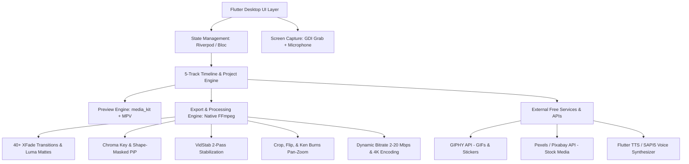

# Master Blueprint & AI Prompt: Z-Movie Maker (OpenAnimotica Clone) v2.0

> **Project Name:** Z-Movie Maker (OpenAnimotica project) v2.0  
> **Target Platforms:** Windows 10/11 Desktop (Primary), macOS & Linux (Secondary)  
> **Tech Stack:** Flutter Desktop, Dart, `media_kit` (MPV engine), native FFmpeg engine, GitHub Actions CI/CD  
> **License:** Open Source (MIT / GPL-3.0 for FFmpeg compliance)

---

## 1. System Overview & Objective (v2.0)

The goal is to build an open-source, modern, hardware-accelerated video editing suite that clones **100% of Animotica's features, layout, workflow, and user interface** with all advanced multitrack editing capabilities, format converters, and export studios hunted from reference screenshots.

### Primary UI Structure & Flow (From Screenshots)
1. **Home / Dashboard & Quick Tools Hub (`Image 1`):**
   - Left Sidebar: Brand logo, Navigation drawer button, Social/Community links, App version tag.
   - Core Workflow Tiles: `Edit video`, `Slideshow`, `Rotate video`, `Convert Video`, `Play DVDs`, `Prepare videos for Animotica`.
   - **Expanded Quick Tools Grid (Instant 1-Click Utilities):**
     - ✂️ `Trim Video` (Dual-handle stream copy lossless trimmer)
     - 🔴 `Record Screen` (60 FPS desktop capture with microphone)
     - 🔄 `Convert Video` (MP4, MKV, MOV, WebM, AVI, GIF transcode)
     - 🔁 `Reverse Video` (Backwards playback with audio reversal)
     - 🛡️ `Stabilize Video` (2-Pass VidStab motion compensation)
     - 🎧 `Extract MP3` (Lossless 320kbps audio rip)
     - 🔄 `Rotate Video` (Lossless 90°, 180°, 270° orientation changer)
     - 🗣️ `Text to Speech` (Voice synthesizer with pitch & speed)
     - 🎵 `Add Background Music` (Mixing with auto-ducking)
     - 🎨 `Effects & Adjust` (20+ LUT filters & color sliders)
     - ⚡ `Fast or Slow Video` (0.1x to 16x speed ramping)
     - 🔇 `Mute Video` (One-click audio strip)

2. **Advanced Multitrack Timeline Workspace (`Image 2`):**
   - **Top Navigation Bar:** `< ALL PROJECTS`, `Untitled - Movie Maker: Video Editor`, `Contact`, `Premium` (Diamond badge), Window Controls.
   - **Main Viewport Area:** Dynamic 16:9 / 9:16 / 1:1 / 4:5 / 21:9 preview canvas with interactive on-canvas drag, scale, rotation handles.
   - **Transport & Scrubbing Bar:**
     - Save Floppy Icon, Undo (`↩`), Redo (`↪`).
     - Frame Stepping (`|◄`, `◄`, `▶ / ⏸`, `►`, `►|`), Mute/Volume (`🔊`).
     - Timecode indicator (`00:00:03.00 / 00:00:03.00`).
     - Aspect ratio selector (`16:9`), Fullscreen toggle (`⛶`).
     - **Timeline Zoom Engine:** Slider with `-` (Zoom Out), `+` (Zoom In), and `Fit to Window` button.
   - **5-Track Multitrack Timeline:**
     - **Track 1 (Video):** Filmstrip thumbnails, audio waveform preview, clip duration badge (`00:00:03`), volume control, and dual-handle trim brackets (`[<` and `>]`).
     - **Track 2 (Audio):** Dedicated music & voiceover layer (with active layer badge).
     - **Track 3 (Overlay / PiP):** Picture-in-Picture videos, shape masks, and GIPHY stickers (with active layer badge).
     - **Track 4 (Text):** Animated subtitles, lower-thirds, and titles (with active layer badge).
     - **Track 5 (Effects):** Color filters, vintage LUTs, blur layers.
     - **Floating Add Button (`+`):** Positioned on the right margin of the timeline to append new clips with one click.
   - **Bottom Action Shelf (Complete Editing Suite):**
     - `← Back` (Blue square button)
     - `+ Add` Media
     - `][ Split` at playhead
     - `|-| Duration` dialog
     - `🎨 Effect` (Color LUTs & filters)
     - `✂ Crop` (Custom aspect ratio & bounding box)
     - `🏃 Motion` (Ken Burns Pan-Zoom animations)
     - `⛶ Transform` (Scale, position, fit/fill canvas)
     - `🔄 Rotate` (90° steps)
     - `⛵ Flip` (Horizontal & Vertical mirror flip)
     - `📄 Duplicate` clip
     - `🗑 Delete` clip
     - `💾 Save Video` (Primary export trigger button)

3. **Advanced Save Video / Export Modal (`Image 3`):**
   - **Video Resolution Slider (5 Tiers):** `480P`, `720P`, `1080P`, `1440P (2K)`, `4K (Ultra HD)`.
   - **Video Quality & Bitrate Slider (4 Tiers):** `Draft (2 Mbps)`, `Standard (10 Mbps)`, `Good (15 Mbps)`, `Best (20 Mbps)`.
   - **Live Estimated File Size Display:** Real-time calculation based on duration × target bitrate (e.g. `Output File Size: 3.75 MB`).
   - **Frame Rate Slider (5 Tiers):** `24 fps`, `25 fps`, `30 fps`, `50 fps`, `60 fps`.
   - **Expandable More Settings:** Codec (libx264, libx265, AV1), Audio sample rate, and channels.
   - **Action Buttons:** `Remove Watermark` (Orange gradient button) and `Export Video` button.

---

## 2. Technical Architecture & Component Stack (v2.0)



---

## 3. Master System Prompt for Complete App Generation

When invoking an AI coding agent to generate the complete codebase, provide this exact prompt:

```text
You are an expert Flutter Desktop & Video Processing Architect.
Your task is to build a complete, 100% working clone of the Animotica Video Editor for Windows in Flutter (Version 2.0).

Requirements:
1. Recreate the exact UI/UX from the reference screenshots:
   - Dashboard with New Project, Open Project, and the 12 Quick Tools (Trim, Screen Record, Format Converter, Reverse, Stabilize, Extract MP3, Rotate, Text-to-Speech, Add Music, Effects, Fast/Slow, Mute).
   - Advanced 5-Track Multitrack Timeline (Master Video, Audio, PiP/Overlay, Text, Effects) with interactive time ruler, dual-handle trim brackets ([< and >]), timeline zoom slider (- / + / Fit), and floating '+' add button.
   - Interactive On-Canvas Overlay Manipulation (Drag-to-move, 4 corner resize handles, 360° rotation knob, double-tap to edit).
   - Bottom Action Shelf with Add, Split, Duration, Effect, Crop, Motion (Ken Burns Pan-Zoom), Transform, Rotate, Flip (H/V), Duplicate, Delete, and Save Video.
   - Advanced Save Video / Export Studio Modal with 5 Resolution Tiers (480p to 4K), 4 Quality Bitrate Tiers (2 Mbps to 20 Mbps), 5 Framerates (24 to 60 fps), live Output File Size Estimator (e.g. 3.75 MB), and More Settings.
   - Transition shelf with 40+ animated xfade presets (Cross Fade, Fade Black, Fade White, Blur, Luma Fades, Wipe, Slide, Zoom).
   - Text-to-Speech Voice Studio, GIPHY Search Modal, and Multi-Track Audio Mixer with Auto-Ducking.

2. Audio/Video Engine:
   - Use 'media_kit' for fluid hardware-accelerated D3D11 timeline scrubbing and playback.
   - Implement an FFmpeg command generation engine that executes non-destructive rendering with Crop (crop=w:h:x:y), Motion (zoompan), Flip (hflip/vflip), Chroma Key (colorkey), and Multi-track audio mixing (amix).

3. Project Serialization:
   - Save and load '.openanimotica' / '.zmovie' JSON project files with full multitrack timeline state restoration.

4. Production-Ready Code:
   - Clean Riverpod state management.
   - Full error handling, null safety, and responsive Windows desktop UI.
   - Complete GitHub Actions build workflow for automated packaging and releases.
```
